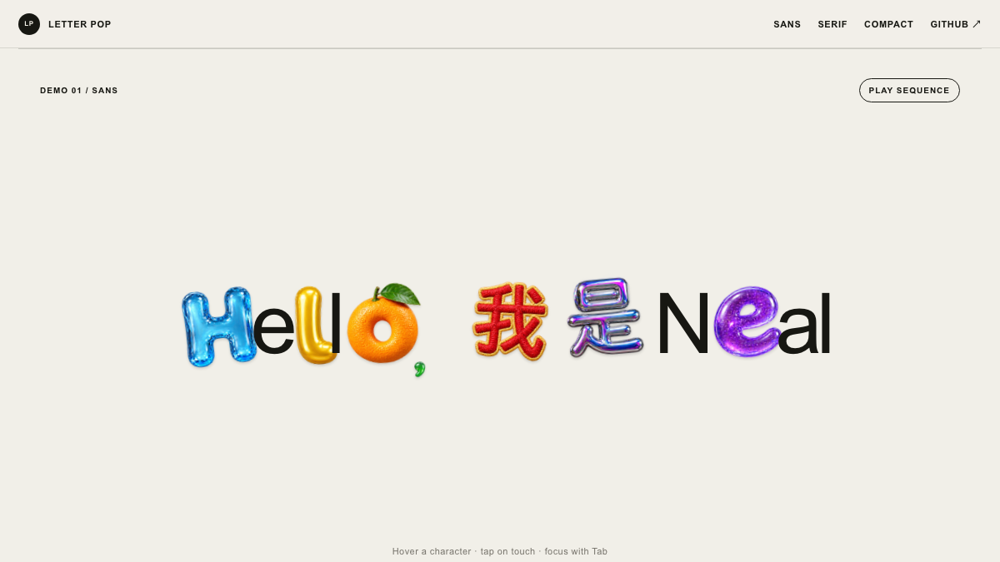
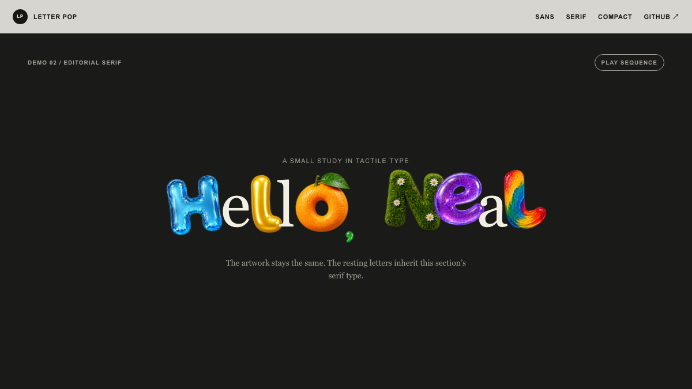
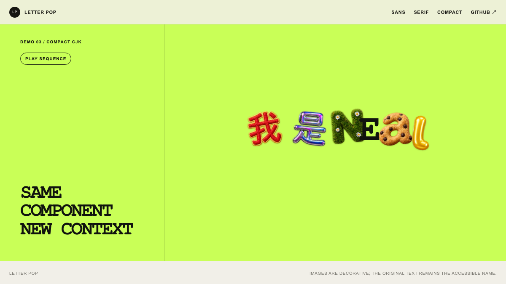
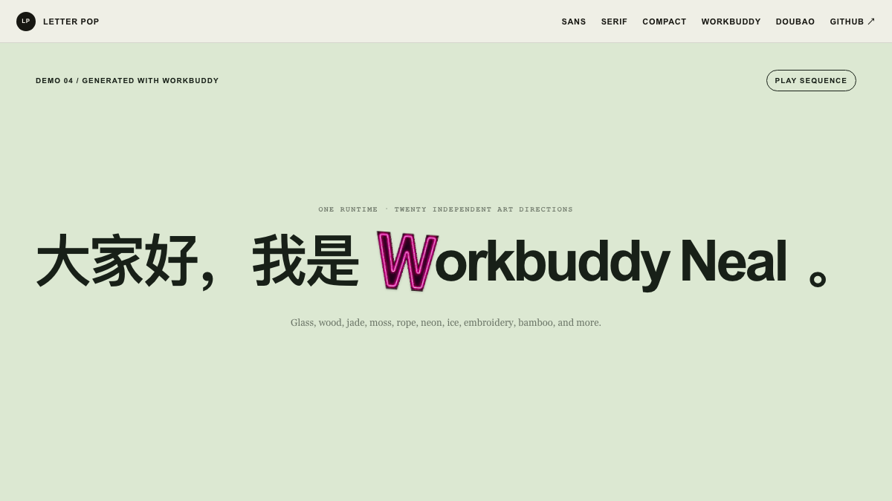
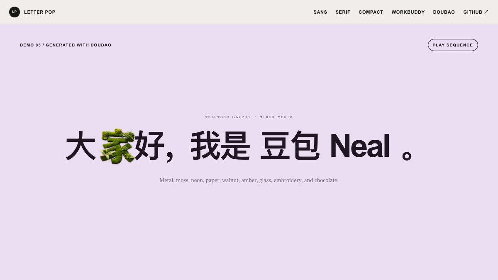
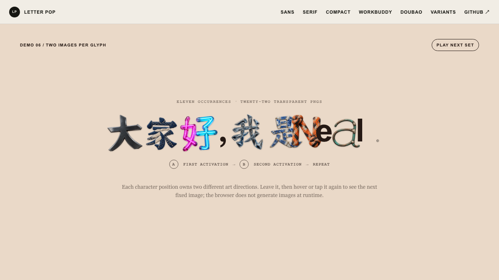

<p align="right">
  <a href="./README.md">English</a> · <strong>简体中文</strong>
</p>

# Letter Pop

一个 Agent Skill，用于把现有网页中的指定文字变成逐字图片替换交互。默认状态保留网页原本的字体；鼠标悬停、触摸或键盘聚焦时，每个字形会变成独立的视觉对象，并让周围文字平滑腾出空间。

这套工作流来自 [OpenAI ChatGPT Images 2.5 发布页](https://openai.com/index/introducing-chatgpt-images-2-5/)的交互形式，并已适配 React、Next.js、Vue、Svelte 和原生前端项目。

在线 Demo 使用固定图片，以保证加载速度和效果一致。Skill 现在自带一个经过测试、无运行时依赖的浏览器组件，Agent 会直接复制交互实现，不再从文字说明重新猜一遍。用于新的文字或项目时，默认仍会生成新素材；如果部分结果不满意，可以保留已认可的字形，只重做指定出现位置。

## 在线 Demo

在[互动演示页面](https://neal-c611.github.io/letter-pop-skill/)中体验鼠标悬停、触摸和键盘操作。同一套图片被放进三种不同的排版环境，用来展示 Letter Pop 会继承宿主网页的字体。

| 无衬线 / 中英混排 | 编辑感衬线体 | 紧凑 CJK |
| --- | --- | --- |
| [](https://neal-c611.github.io/letter-pop-skill/#sans) | [](https://neal-c611.github.io/letter-pop-skill/#serif) | [](https://neal-c611.github.io/letter-pop-skill/#compact) |

同一个 Skill 也分别在 WorkBuddy 和豆包中运行过。下面保留了它们实际生成的素材，并统一使用 Letter Pop 自带的交互组件：

| WorkBuddy 生成 | 豆包生成 |
| --- | --- |
| [](https://neal-c611.github.io/letter-pop-skill/#workbuddy) | [](https://neal-c611.github.io/letter-pop-skill/#doubao) |

### 每个字两张图

[](https://neal-c611.github.io/letter-pop-skill/#variants)

这个 Demo 为 `大家好，我是Neal。` 的 11 个字符位置分别准备了两张不同艺术方向的透明 PNG，共 22 张。第一次 hover、触摸或键盘聚焦显示 A 图；该字符恢复原状后，下一次触发显示 B 图，随后循环。两组图片都提前生成并预加载，网页运行时不会调用生图模型。Skill 仍默认每个字符位置生成一张；需要这种效果时，可以指定整句话每字两张，也可以只给个别字符增加变体，以控制生图成本。

## 能做什么

- 在现有代码中找到指定文字，只修改目标位置。
- 保留宿主网页原有的字体、字号、字重、颜色、语义、换行和断点。
- 按字形出现的位置规划素材，支持重复字母、中文、Emoji 和组合字符。
- 为每个字形分配不同的视觉媒介、构造方式和呈现手法；只换颜色不算不同风格。
- 默认每个字形使用一张图片，也可只为指定字形添加多张轮换变体。
- 让标点保持较小的视觉尺寸和自然的基线位置。
- 生成或接入透明背景图片素材。
- 使用稳定的命中层，避免字形放大后造成悬停抖动。
- 对未知生图工具先测试一个代表字，再用一小批强对比风格检查模型是否听从逐字要求。
- 自动检查真实 PNG、alpha 覆盖，并输出浅色、深色和灰度检查图。
- 支持鼠标、触摸、键盘焦点和 `prefers-reduced-motion`。
- 在真实页面中检查素材加载、控制台错误、换行和移动端溢出。

## 安装

### Codex

让 Codex 直接从 GitHub 安装：

```text
$skill-installer install https://github.com/neal-c611/letter-pop-skill
```

也可以手动克隆到 Agent 的全局 Skill 目录：

```bash
mkdir -p "$HOME/.agents/skills"
git clone https://github.com/neal-c611/letter-pop-skill.git \
  "$HOME/.agents/skills/letter-pop"
```

部分 Codex 安装使用 `$CODEX_HOME/skills`。使用默认 Codex 目录时，命令如下：

```bash
mkdir -p "$HOME/.codex/skills"
git clone https://github.com/neal-c611/letter-pop-skill.git \
  "$HOME/.codex/skills/letter-pop"
```

### WorkBuddy

安装为用户级 WorkBuddy Skill：

```bash
mkdir -p "$HOME/.workbuddy/skills"
git clone https://github.com/neal-c611/letter-pop-skill.git \
  "$HOME/.workbuddy/skills/letter-pop"
```

重启 WorkBuddy 或新建一个对话，然后使用 `/skills` 确认 `letter-pop` 已加载。

需要生成新字形时，请确认 WorkBuddy 的 `ImageGen` 工具已经启用，并允许它提出的工具授权。Kimi-K3 的视觉能力可以理解图片，实际生成图片由独立的 `ImageGen` 工具完成。Letter Pop 会先验证一个代表字，再用 3–5 个刻意互不相似的视觉方向测试小图集；两项检查都通过后，才继续生成剩余的小批次。交互部分会直接复制 Skill 自带的浏览器组件。

### OpenClaw

把仓库根目录中的 Skill 安装为全局 Skill：

```bash
openclaw skills install git:neal-c611/letter-pop-skill@main --global
```

新建会话后使用 `openclaw skills list` 检查。OpenClaw 使用 AgentSkills 的 `SKILL.md` 格式，安装时会保留组件和检查脚本。

### Hermes Agent

把完整仓库克隆到 Hermes 的本地 Skill 目录：

```bash
mkdir -p "$HOME/.hermes/skills"
git clone https://github.com/neal-c611/letter-pop-skill.git \
  "$HOME/.hermes/skills/letter-pop"
```

随后新建会话或执行 `/reset`，再用 `hermes skills list` 检查。部分 Hermes 版本会把 Raw `SKILL.md` URL 当成单文件 Skill，因此应克隆完整仓库。

### 不使用 Git 下载

下载仓库 ZIP：

```text
https://github.com/neal-c611/letter-pop-skill/archive/refs/heads/main.zip
```

解压后把文件夹改名为 `letter-pop`，再放入 Agent 的用户级或项目级 Skill 目录。

## 使用

```text
用 letter-pop 把首页的“Hello, 我是Neal”做成这个效果。
```

正常情况下，这一句就够了。素材生成、透明背景检查、交互细节、无障碍、响应式布局和浏览器验证都由 Skill 自动处理。只有同一句文字在页面中出现多次、目标位置无法判断时，才需要补充选择器或源组件位置。

## 运行要求

自带的浏览器组件没有运行时依赖。创建新字形素材需要图片生成能力，或者由用户提供素材。如果生成模型不能直接输出 alpha，Letter Pop 会先用一个字测试纯色幕布流程，再使用附带的 ImageMagick 脚本转换成 RGBA PNG；透明度探测或风格对比小图集失败时，都会停止后续生图。较长文字会拆成每批不超过五个字形的小图集，避免模型给整句话套上同一种渲染风格。组件的 `verify()` 会配合浏览器自动化检查命中区域、素材加载、换行和页面溢出。

如果 hover 后出现方框，应检查文件的真实格式和 alpha 通道。即使文件名以 `.png` 结尾，画进 RGB/JPEG 图片里的棋盘格依然是不透明背景。此时应在纯色幕布上重新生成，再运行 `scripts/remove-solid-matte.sh`，不要尝试用 CSS 隐藏方框。

## 文件结构

```text
letter-pop-skill/
├── SKILL.md
├── agents/
│   └── openai.yaml
├── assets/
│   └── vanilla/
│       ├── letter-pop.js
│       ├── letter-pop.css
│       └── example.js
├── scripts/
│   ├── remove-solid-matte.sh
│   └── validate-glyph-assets.sh
└── references/
    ├── artwork-generation.md
    └── implementation-pattern.md
```

## 许可证

MIT
